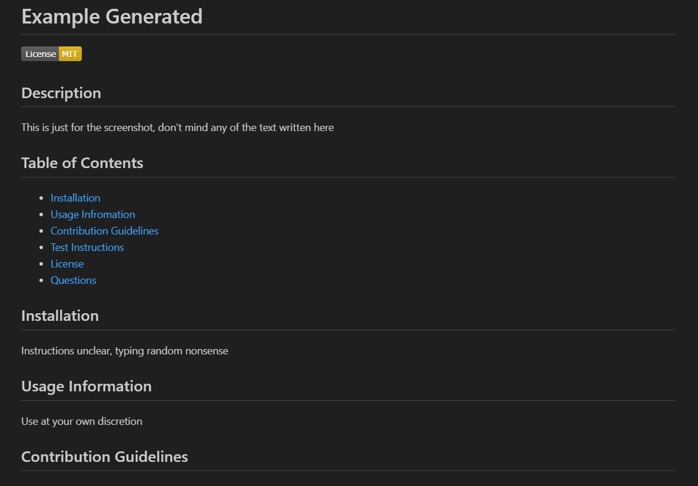

# **Module 9 Challenge:** NPM README.md maker

## Description

The goal of this project was to create a README.md file from the user's inputs in the terminal using node. After receiving the user's inputs in the terminal (thanks to the usage of the Inquirer package), the program then uses a template literal to create a README file with all the detail provided. Additionally, this README file is set up to create a small badge near the top of the README to display which license the user chose to use for their project. This project is 100% JavaScript based, using NPM to make things work through the terminal.

## Preview

The video linked here provides an example walkthrough of the code in action:
[README.md maker sample video](https://drive.google.com/file/d/1wyVTuKKqCys0eFqlXXG2eKagKUrCC4O_/view)

Provided here is a top-half screenshot of an example README.md file created with this code: 